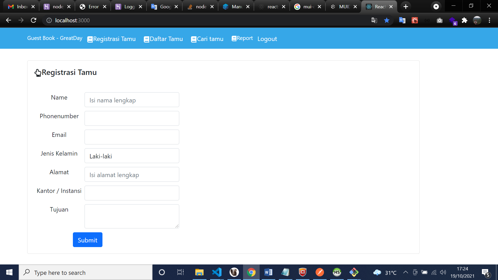
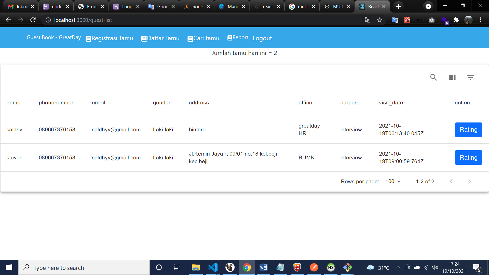
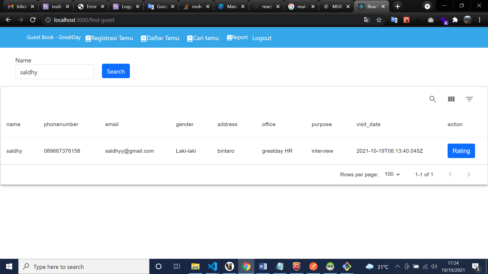

# greatday-guest book

## Table of Contents

- [Getting Started](#getting-started)
  - [Prerequisites](#prerequisites)
  - [Installation](#installation)
- [Screenshots](#screenshots)
- [Built With](#built-with)
- [Author](#author)
- [License](#license)

## Getting Started

Before starting to install the project, there're some things that need to be done first.

### Prerequisites

Make sure all of these are properly installed in your system.

| Application  | Download                                                                            |
| ------------ | ----------------------------------------------------------------------------------- |
| Git          | [Windows](https://gitforwindows.org/) / [Linux](https://git-scm.com/download/linux) |
| Node.js      | [Link](https://nodejs.org/en/download/)                                             |
| PostgreSQL        | [Link](https://www.postgresql.org/download/)                                            |

### Installation

First, clone this repository into your system.

```
git clone https://github.com/saldhyyoga/greatday
```

Then, install all the packages that described in `package.json`

if yout want to see front end app, follow this link 
https://github.com/saldhyyoga/greatday-frontend

```
npm install
```


## Screenshots

1. admin can register guest who come

actually i want to add feature send link via email to user after register by admin for rating.

2. admin can see number of visitor


3. admin can search guest visit history


## Built With

- [React JS](https://expressjs.com/en/starter/installing.html) - Front-end
- [Express JS](https://expressjs.com) - Back-end
- [PostgreSQL](https://www.postgresql.org) - Database
